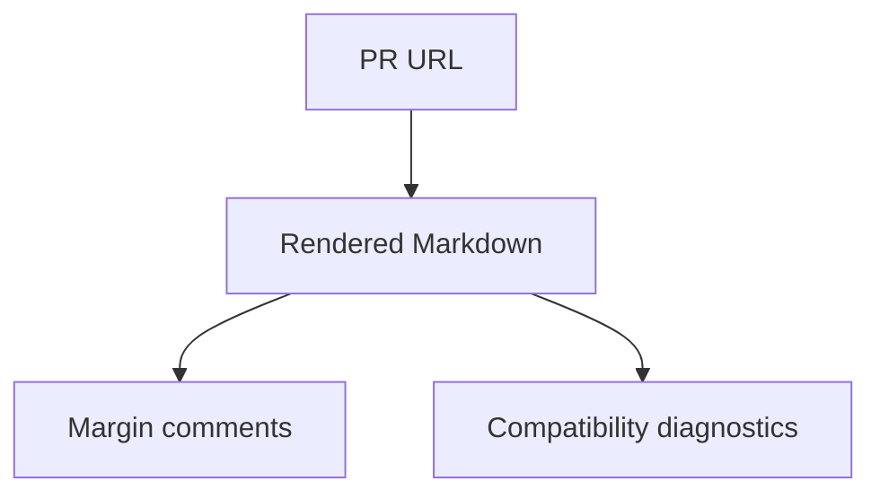
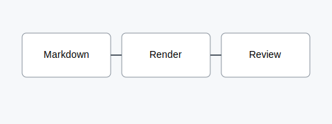

# Core Markdown Extension Matrix

> [!NOTE]
> This document intentionally mixes common GitHub Markdown with repository-aware extensions so reviewers can inspect rendering, diagnostics, and anchors in one place.

## Review Checklist

- [x] Frontmatter appears as document metadata.
- [x] GitHub callouts render as annotations.
- [ ] Missing links are reported without breaking the document.
- [ ] Embeds preserve readable fallback behavior.

| Feature | Expected behavior | Manual check |
| --- | :---: | --- |
| Mermaid | Rendered diagram | Diagram becomes an SVG in the browser |
| Invalid Mermaid | Source fallback | Error state preserves source |
| Wikilink | Resolved link | `[[Guide]]` points to the guide file |
| Asset | Resolved image | Local SVG loads from raw GitHub content |

## Mermaid



```mermaid
flowchart TD
  Broken -->
```

## Repository Links

Standard relative links:

- [Guide](guide.md#install)
- [Missing page](missing.md)
- [Architecture overview](architecture-overview.md)

Wikilinks:

- [[Guide]]
- [[Guide#Install]]
- [[Architecture Overview|Architecture alias]]
- [[Topic]]
- [[Missing Page]]

## Embeds

The first embed includes a full page:

![[partials/install-steps]]

The second embed includes a heading section:

![[guide#Install]]

The third embed shows an image asset:

![[assets/diagram.svg]]

The fourth embed intentionally creates a missing-target placeholder:

![[partials/missing-card]]

## MDX Signals

import DemoWidget from "../components/DemoWidget";

export const fixtureName = "core-extension-matrix";

<DemoWidget value="safe-placeholder" />

## Asset Links




## Anchor Target

This paragraph is here for manual comment anchoring and refresh testing.
