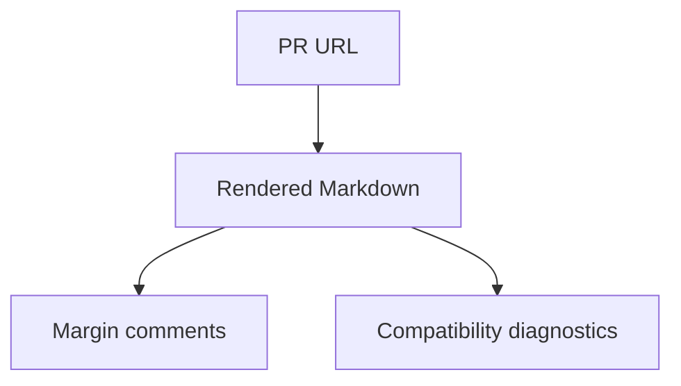
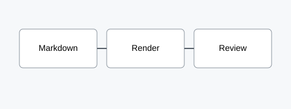

# Core Markdown Extension Matrix

> [!NOTE]
> This document intentionally mixes common GitHub Markdown with repository-aware extensions so reviewers can inspect rendering, diagnostics, and anchors in one place.

## Review Checklist

- [x] Frontmatter appears as document metadata.
- [x] GitHub callouts render as annotations.
- [ ] Missing links are reported without breaking the document.
- [ ] Embeds preserve readable fallback behavior.

| Feature | Expected behavior | Manual check |
| --- | :---: | --- |
| Mermaid | Rendered diagram | Diagram becomes an SVG in the browser |
| Invalid Mermaid | Source fallback | Error state preserves source |
| Wikilink | Resolved link | `[[Guide]]` points to the guide file |
| Asset | Resolved image | Local SVG loads from raw GitHub content |
| Visual regions | Rectangular annotation | PNG, JPEG, WebP, AVIF, SVG, and Mermaid share the standard thread surface |
| Repeated source | Occurrence-specific markers | A marker appears only on the selected SVG occurrence |

## Mermaid

```mermaid
flowchart TD
  Intake[PR URL] --> Render[Rendered Markdown]
  Render --> Comment[Margin comments]
  Render --> Diagnostics[Compatibility diagnostics]
```

Standalone source: [review-flow.mmd](diagrams/review-flow.mmd)

```mermaid
flowchart TD
  Broken -->
```

## Repository Links

Standard relative links:

- [Guide](guide.md#install)
- [Missing page](missing.md)
- [Architecture overview](architecture-overview.md)

Wikilinks:

- [[Guide]]
- [[Guide#Install]]
- [[Architecture Overview|Architecture alias]]
- [[Topic]]
- [[Missing Page]]

## Embeds

The first embed includes a full page:

![[partials/install-steps]]

The second embed includes a heading section:

![[guide#Install]]

The third embed shows an image asset:

![[assets/diagram.svg]]

The fourth embed intentionally creates a missing-target placeholder:

![[partials/missing-card]]

## MDX Signals

import DemoWidget from "../components/DemoWidget";

export const fixtureName = "core-extension-matrix";

<DemoWidget value="safe-placeholder" />

## Asset Links

## Visual Artifact Format Matrix

Activate visual annotation before dragging a rectangle. The dashboard is intentionally detailed enough to exercise Fit, zoom, and pan. These four files contain the same static pixels in different supported encodings.

### PNG

### JPEG

### WebP

### AVIF

## Source-backed SVG and occurrence identity

Annotate the dashed rollback route or the ownership handoff between Render and Review. Raw mode remains available when the SVG is opened as a standalone file.

This second embed uses the identical source path. A marker created here must remain distinct from a marker on the first occurrence.

Standalone source: [review-workflow.svg](assets/review-workflow.svg)

## Anchor Target

This paragraph is here for manual comment anchoring and refresh testing.
